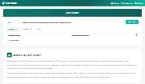

# Network & API Tools — Tools 2 All

4 free, browser-based tools in this category on **[2all.in](https://2all.in/developer/)**. No signup, no file uploads, everything runs locally in your browser.

| Tool | Description |
|---|---|
| [CURL-to-Code Universal Converter](https://2all.in/developer/curl-to-code.html) | Paste a curl command, get Python, JavaScript, PHP, Go, and Rust code. |
| [HTTP/API Request Tool](https://2all.in/developer/api-tester.html) | Send GET/POST/PUT/DELETE requests and inspect the response, right in your browser. |
| [IPv4/IPv6 Subnet Calculator](https://2all.in/developer/subnet-calculator.html) | Calculate network address, broadcast, and usable host range from CIDR. |
| [Timestamp Converter](https://2all.in/developer/timestamp-converter.html) | Convert Unix timestamps to human-readable dates and back, instantly. |

_Browse this category live: [https://2all.in/developer/](https://2all.in/developer/)_

_See the [full directory](../../README.md) of every tool across all categories._
