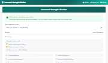

# Security & Privacy — Tools 2 All

4 free, browser-based tools in this category on **[2all.in](https://2all.in/developer/)**. No signup, no file uploads, everything runs locally in your browser.

| Tool | Description |
|---|---|
| [.env File Sanitizer & Secret Redactor](https://2all.in/developer/env-sanitizer.html) | Redact API keys and passwords from a config file before sharing it. |
| [Hash Generator](https://2all.in/developer/hash-generator.html) | Generate MD5, SHA-1, SHA-256, and SHA-512 hashes instantly. |
| [JWT Decoder](https://2all.in/developer/jwt-decoder.html) | Decode and inspect JSON Web Tokens - header, payload, and expiry. |
| [Password Strength Checker](https://2all.in/developer/password-strength-checker.html) | Check how strong your password is and how long it'd take to crack. |

_Browse this category live: [https://2all.in/developer/](https://2all.in/developer/)_

_See the [full directory](../../README.md) of every tool across all categories._
